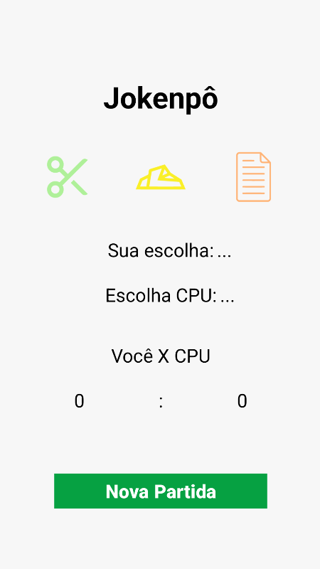

# Jogo JoKenPo

Aplicativo Android desenvolvido em Kotlin que implementa o clássico jogo **JoKenPo** (Pedra, Papel e Tesoura). O jogador escolhe uma opção e compete contra CPU, as pontuações de ambos os jogadores são marcadas em um placar.

O jogador pode jogar várias rodadas contra a CPU e limpar os pontos a qualquer momento criando no botão "Nova Partida" 



## Instalação

Clone este repositório:
   ```bash
   git clone https://github.com/GabriellyVitoria5/App_Jokenpo
